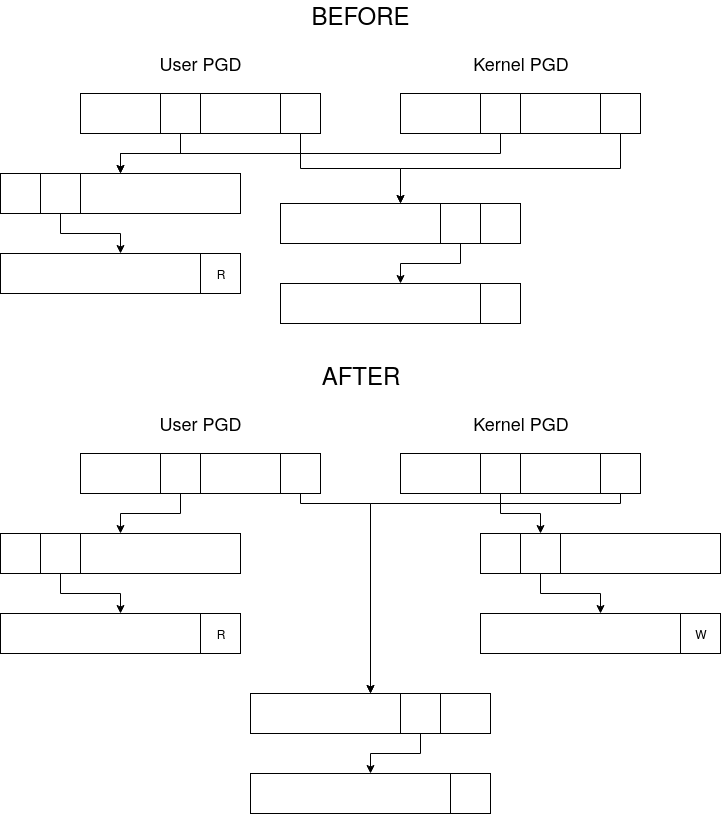

# Kernel TOCTTOU Protection

## Overview

The goal of the project is to prevent TOCTTOU attacks from userspace and secure double fetches from the kernel. This will also allow us to implement system call filtering in a reliable way.

We will use the paging mechanism to protect the sensitive data. All data that a system call reads is **marked** read-only. The thread that is executing the syscall is called **an owner**. Writes to the marked page are considered **offending writes**.
Threads that issue offending writes will wait until the syscall is completed. Waiting threads are called **guests**.

We will differentiate two main types of pages:

- anonymous
- file-backed

Anonymous pages are stored solely in RAM. This makes securing anonymous pages easier - they are shared only between the threads of the same process.
File-backed pages are loaded from the external memory and periodically written back. They can be mapped, unmapped and have different permissions in different processes.

Another important subtype is a Copy-on-Write page. They are created when a process call fork. Its memory isn't copied to a child, but only shared. The copy occurs the first time ony of the processes tries to write to the page. At that moment, the writing process will obtain its private copy, while all others will continue sharing it.

## Struct Page Changes

We want to keep struct page as small as possible. We only add a single pointer to the extra data. This pointer is used to determine whether the page is marked or not.

## TO DO: Page faults, memory mapping, on-demand paging utilization

## KPTI Bypass

Kernel Page Table Isolation was introduced in the kernel to prevent Meltdown. It introduced a second PGD table. The first one is used only in the user mode, and maps only parts of the kernel. The second one, in addition to the same P4Ds as the first one, maps the rest of the kernel memory as well. It is worth noting that only the PGD table is separate, all other levels are shared.

When booting the Linux kernel, it will start with a temporary clk signal before switching to the standard clock. This switch involves a system call that reads from the memory (marks it) and writes to it afterwards. The write makes the only running thread wait for itself to finish. The problem cannot be solved by switching the permissions in the page table to W because it would also enable writes for the user.

We solve this problem by detecting this condition in the page fault handler and modifying the kernel page table. We follow the path to the faulting address and allocate corresponding kernel nodes on the path. If we detect that the entry has already been allocated (another syscall performed a KPTI bypass), we add our own data. After flushing the TLB and updating the MMU cache, we restart the call.

## CoW Extension

If the syscall from the previous section is called with KPTI Bypass on a CoW page, it will stall again. The current implementation waits for the page to be unmarked before breaking the CoW. Hence, it will wait for itself again.

We extend the CoW mechanism by introducing the concept of **ownership**. Normally, pages are not marked, so they don't have an owner. Marked pages have owners - the processes that marked them. Writing to an unmarked CoW page will only result in a private copy for the writing process.
Writing to a marked page will cause both the owners and a writing process to obtain their private copies.
This will leave the original page completely unmarked, and possibly still shared by other processes. Note that the writing process continues execution even though no owners unmarked the page.

